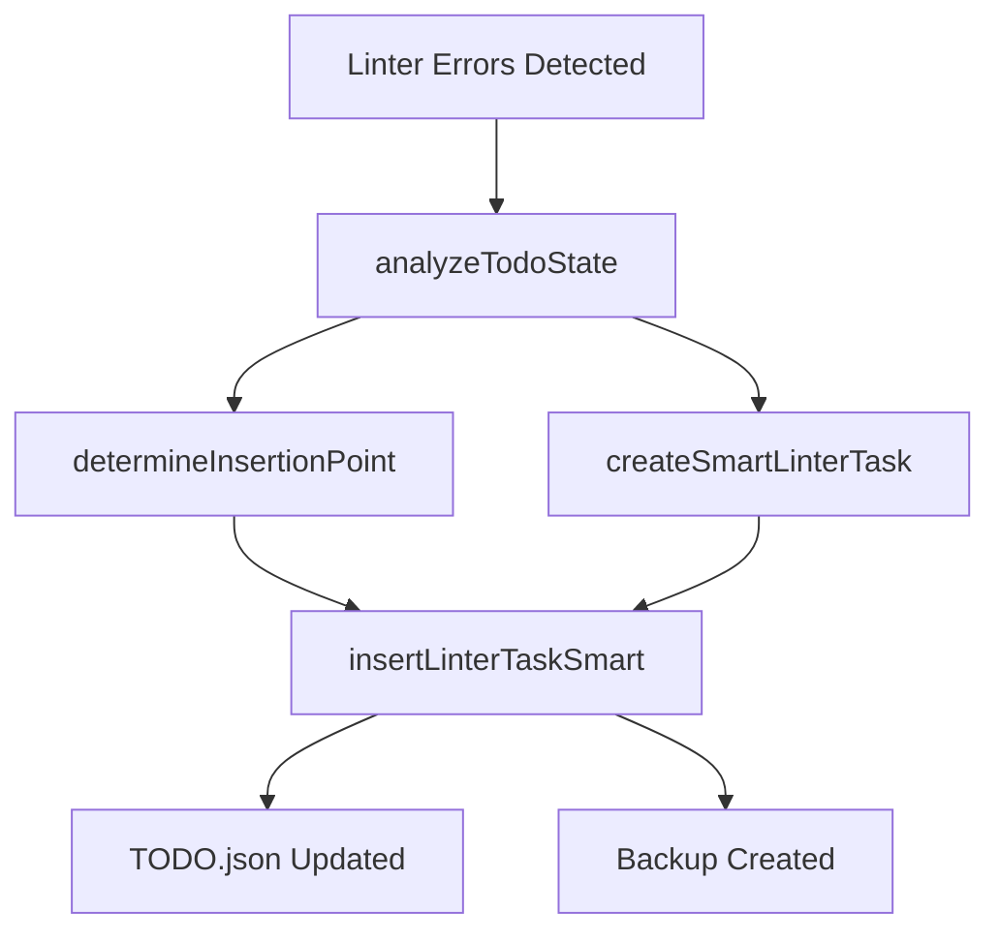

# Smart Task Placement System

The Post-Tool Linter Hook includes an intelligent task placement system that automatically creates and manages linter error resolution tasks in your project's TODO.json file.

## Overview

When linting errors are detected, the hook doesn't just provide feedback—it actively integrates error resolution into your project workflow by creating properly positioned, well-structured tasks in your TODO.json file.

## Architecture

### Core Components

The smart task placement system consists of four main functions:

1. **`analyzeTodoState(projectPath)`** - Analyzes current TODO.json structure and task state
2. **`determineInsertionPoint(analysis)`** - Calculates optimal task placement position  
3. **`createSmartLinterTask(results, projectPath, filePaths, analysis)`** - Generates comprehensive linter tasks
4. **`insertLinterTaskSmart(linterTask, analysis, projectPath)`** - Performs atomic TODO.json updates

### Data Flow



## Function Reference

### analyzeTodoState(projectPath)

Analyzes the current state of the project's TODO.json file.

**Parameters:**
- `projectPath` (string): Absolute path to the project directory

**Returns:**
```javascript
{
  todoData: Object,           // Parsed TODO.json content
  currentTask: Object,        // Currently active task
  currentTaskIndex: number,   // Index of current task
  pendingTasks: Array,        // All pending tasks
  highPriorityTasks: Array,   // High priority pending tasks
  totalTasks: number          // Total number of tasks
}
```

**Example Usage:**
```javascript
const analysis = await analyzeTodoState('/path/to/project');
console.log(`Found ${analysis.totalTasks} tasks, ${analysis.pendingTasks.length} pending`);
```

### determineInsertionPoint(analysis)

Calculates the optimal position for inserting a new linter task.

**Strategy:** Inserts linter tasks immediately after the current active task, making them the next highest priority without disrupting ongoing work.

**Parameters:**
- `analysis` (Object): Result from `analyzeTodoState()`

**Returns:**
- `number`: Array index where the new task should be inserted

**Example:**
```javascript
const insertionIndex = determineInsertionPoint(analysis);
// If current task is at index 4, returns 5 (insert after current)
```

### createSmartLinterTask(results, projectPath, filePaths, analysis)

Creates a comprehensive linter task with proper metadata and references.

**Parameters:**
- `results` (Array): Linter results from hook execution
- `projectPath` (string): Absolute path to project directory
- `filePaths` (Array): Array of file paths that were linted
- `analysis` (Object): TODO state analysis (currently unused, reserved for future enhancements)

**Returns:**
```javascript
{
  id: string,                    // Unique task ID: linter_fix_${timestamp}
  title: string,                 // "Fix Linter Errors - IMMEDIATE"
  description: string,           // Summary of errors and files
  mode: "DEVELOPMENT",           // Task mode
  priority: "high",              // Always high priority
  status: "pending",             // Initial status
  important_files: Array,        // Files to reference
  success_criteria: Array,       // Completion requirements
  created_at: string,            // ISO timestamp
  is_linter_task: true          // Identification flag
}
```

**Task Structure Example:**
```javascript
{
  "id": "linter_fix_1753429874819",
  "title": "Fix Linter Errors - IMMEDIATE",
  "description": "Fix 0 errors and 11 warnings found in recently edited files: test-file.js",
  "mode": "DEVELOPMENT",
  "priority": "high",
  "status": "pending",
  "important_files": [
    "development/linter-errors.md",
    "test-file.js"
  ],
  "success_criteria": [
    "All linter errors in edited files resolved",
    "development/linter-errors.md shows no issues for edited files",
    "Code passes linting without warnings or errors"
  ],
  "created_at": "2025-07-25T07:51:14.819Z",
  "is_linter_task": true
}
```

### insertLinterTaskSmart(linterTask, analysis, projectPath)

Performs atomic insertion of the linter task into TODO.json with backup creation.

**Parameters:**
- `linterTask` (Object): Task object from `createSmartLinterTask()`
- `analysis` (Object): TODO state analysis
- `projectPath` (string): Absolute path to project directory

**Returns:**
- `boolean`: Success status of the insertion operation

**Features:**
- **Atomic Operations**: Ensures TODO.json integrity
- **Automatic Backups**: Creates timestamped backup files
- **Error Handling**: Graceful failure with logging
- **Strategic Positioning**: Inserts at calculated optimal position

## Configuration

### Task Identification

Linter tasks are identified by the `is_linter_task: true` property, allowing for easy filtering and management.

### Important Files Array

Every linter task includes a comprehensive `important_files` array:

1. **`development/linter-errors.md`** - Always included for detailed error information
2. **Source files** - All files that contained linting violations

### Success Criteria

Standard success criteria ensure consistent completion validation:

- "All linter errors in edited files resolved"
- "development/linter-errors.md shows no issues for edited files"  
- "Code passes linting without warnings or errors"

## Integration Points

### TODO.json Schema Requirements

The system works with TODO.json files that have:

```javascript
{
  "project": "project-name",
  "tasks": [],                    // Array of task objects
  "current_task_index": 0,        // Optional: current task pointer
  "last_hook_activation": 0       // Optional: timestamp tracking
}
```

### Backup Management

Backup files are created with the naming pattern:
```
TODO.json.backup.${timestamp}
```

Example: `TODO.json.backup.1753429874819`

### Error Handling

The system includes comprehensive error handling:

- **File System Errors**: Graceful degradation when TODO.json is unreadable
- **JSON Parsing Errors**: Safe handling of malformed TODO.json files
- **Permission Issues**: Appropriate error messages for write failures
- **Concurrent Access**: Safe handling of simultaneous modifications

## Usage Examples

### Basic Integration

```javascript
// Main hook workflow integration
const analysis = await analyzeTodoState(projectPath);
let taskCreated = false;

if (analysis) {
  const linterTask = await createSmartLinterTask(results, projectPath, filePaths, analysis);
  taskCreated = await insertLinterTaskSmart(linterTask, analysis, projectPath);
  log(`Smart task creation result: ${taskCreated}`);
}
```

### Manual Task Creation

```javascript
// Create a linter task manually
const mockResults = [
  {
    file: 'test.js',
    violations: [
      { severity: 'error', message: 'Undefined variable', line: 10 }
    ]
  }
];

const analysis = await analyzeTodoState('./my-project');
const task = await createSmartLinterTask(mockResults, './my-project', ['test.js'], analysis);
const success = await insertLinterTaskSmart(task, analysis, './my-project');
```

## Best Practices

### Task Management

1. **Immediate Priority**: Linter tasks are always created with high priority
2. **Strategic Positioning**: Tasks are placed after the current active task
3. **Comprehensive Metadata**: All tasks include detailed file references and success criteria
4. **Atomic Updates**: TODO.json modifications are always atomic with backup creation

### Error Prevention

1. **Validation**: Always validate TODO.json structure before modification
2. **Backups**: Create backups before any TODO.json changes
3. **Logging**: Log all operations for debugging and audit trails
4. **Graceful Degradation**: Continue hook operation even if task creation fails

### Performance Considerations

1. **Efficient Parsing**: TODO.json is parsed once per hook execution
2. **Minimal File I/O**: Batch file operations where possible
3. **Error Caching**: Avoid repeated analysis of the same files
4. **Cleanup**: Regular cleanup of backup files to prevent disk usage issues

## Troubleshooting

### Common Issues

**Task Not Created:**
- Check TODO.json exists and is valid JSON
- Verify project directory permissions
- Review hook logs in `post-tool-linter-hook.log`

**Wrong Task Position:**
- Verify `current_task_index` is correctly set in TODO.json
- Check that the insertion algorithm logic matches your workflow

**Backup Files Accumulating:**
- Implement periodic cleanup of old backup files
- Monitor disk usage in projects with frequent linting

**Performance Issues:**
- Large TODO.json files may slow insertion operations
- Consider optimizing TODO.json structure for better performance

### Debugging

Enable verbose logging by checking the hook log file:
```bash
tail -f post-tool-linter-hook.log
```

Common log messages:
- `Analyzing TODO.json state for smart task placement...`
- `Found X existing tasks`
- `Created linter task: linter_fix_XXXXX with Y issues`
- `Inserted linter task at index Z`

## Future Enhancements

### Planned Features

1. **Dependency Analysis**: Automatic task dependency detection
2. **Priority Adjustment**: Dynamic priority based on error severity
3. **Batch Operations**: Handle multiple file modifications efficiently
4. **Integration Points**: Better integration with project management tools
5. **Custom Placement**: User-configurable task placement strategies

### API Extensibility

The system is designed for extensibility:

```javascript
// Future: Custom placement strategies
const customStrategy = {
  analyze: (todoData) => { /* custom analysis */ },
  position: (analysis) => { /* custom positioning */ }
};

const task = await createSmartLinterTask(results, projectPath, files, analysis, customStrategy);
```

This documentation provides comprehensive coverage of the smart task placement system's architecture, usage, and integration points for both users and developers working with the codebase.