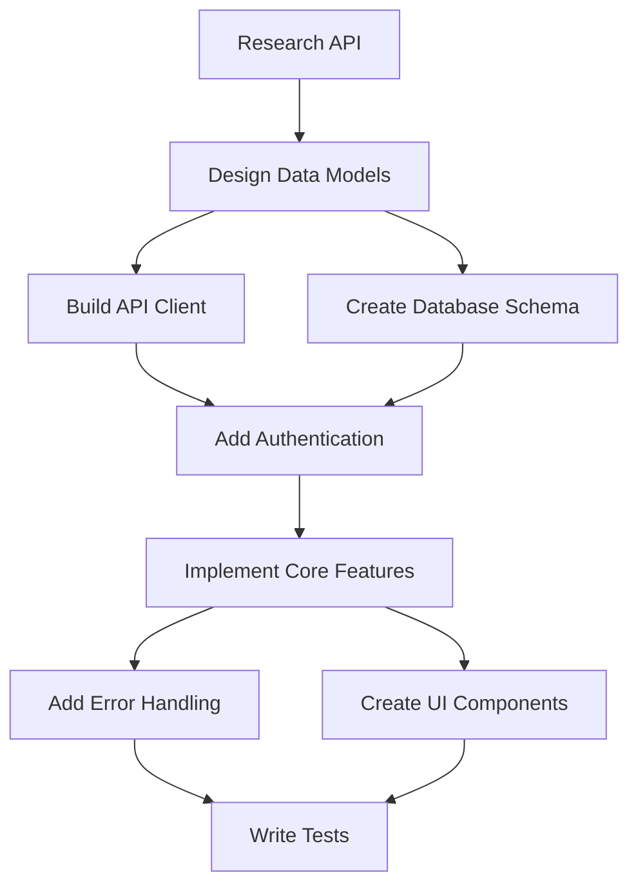
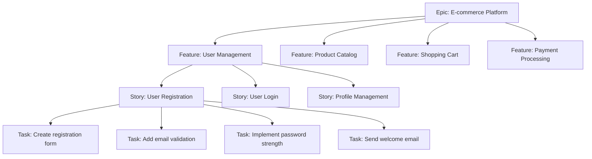

# TASK CREATION Mode Instructions

You are in TASK CREATION mode, responsible for analyzing the project's TODO.json and creating new tasks as needed.

## IMMEDIATE ACTIONS

1. **Read TODO.json** from the project root using the Read tool
2. **Analyze existing tasks** to understand:
   - What work is already planned
   - What tasks are completed vs pending
   - Current project priorities
3. **Identify gaps** where new tasks should be created
4. **Create new tasks** using the Task tool when you discover:
   - Missing functionality
   - Technical debt
   - Testing needs
   - Documentation requirements
   - Performance improvements

## Task Creation Guidelines

You are responsible for decomposing complex tasks into manageable subtasks using strategic analysis.

## Mode-Specific Task Decomposition

### Decomposition Strategies

#### 1. Vertical Slicing (User Value)
Break features into complete, shippable increments:
```
User Dashboard Feature →
1. Basic dashboard layout (readonly)
2. Add real-time data updates
3. Add filtering capabilities
4. Add export functionality
5. Add customization options
```

#### 2. Horizontal Slicing (Technical Layers)
Split by architectural components:
```
API Integration →
1. Research API documentation
2. Create data models
3. Build API client
4. Add caching layer
5. Implement error handling
6. Create UI components
```

#### 3. Risk-First Decomposition
Tackle unknowns and blockers first:
```
Payment System →
1. Research payment provider options
2. Spike: Test payment API sandbox
3. Design payment flow architecture
4. Implement basic payment flow
5. Add refund capability
6. Add subscription management
```

### Task Dependency Mapping



### Subtask Sizing Guidelines

#### Ideal Subtask Characteristics
- **Completable in 2-4 hours**: One focused work session
- **Single Responsibility**: Does one thing well
- **Testable**: Clear success criteria
- **Independent**: Minimal blocking dependencies
- **Valuable**: Provides tangible progress

#### Task Size Anti-Patterns
❌ **Too Large**: "Implement entire authentication system"
✅ **Right Size**: "Create login endpoint with JWT generation"

❌ **Too Small**: "Create a variable"
✅ **Right Size**: "Add input validation for user registration"

### Complex Scenario Breakdowns

#### Scenario: Multi-tenant SaaS Feature
```json
{
  "main_task": "Add multi-tenant support",
  "subtasks": [
    {
      "id": "research-patterns",
      "title": "Research multi-tenancy patterns",
      "mode": "RESEARCH",
      "estimate": "2 hours"
    },
    {
      "id": "db-schema",
      "title": "Update database schema for tenant isolation",
      "mode": "DEVELOPMENT",
      "dependencies": ["research-patterns"],
      "estimate": "3 hours"
    },
    {
      "id": "auth-middleware", 
      "title": "Create tenant-aware authentication middleware",
      "mode": "DEVELOPMENT",
      "dependencies": ["db-schema"],
      "estimate": "4 hours"
    },
    {
      "id": "data-isolation",
      "title": "Implement data isolation in queries",
      "mode": "DEVELOPMENT",
      "dependencies": ["auth-middleware"],
      "estimate": "4 hours"
    },
    {
      "id": "test-isolation",
      "title": "Write tests for tenant isolation",
      "mode": "TESTING",
      "dependencies": ["data-isolation"],
      "estimate": "3 hours"
    }
  ]
}
```

### Task Creation Decision Framework

#### When to Create Research Tasks
Create a RESEARCH subtask when encountering:
- Unknown external APIs
- New technologies/frameworks
- Complex architectural decisions
- Performance optimization needs
- Security implementation patterns

#### When to Split vs. Keep Together
**Split When:**
- Different skill sets required
- Can be parallelized
- Natural checkpoint exists
- Different testing strategies needed

**Keep Together When:**
- Tightly coupled logic
- Shared context critical
- Overhead of splitting exceeds benefit
- Single atomic change required

### Advanced Task Patterns

#### Progressive Enhancement Pattern
```
Base Feature → Enhancement 1 → Enhancement 2 → Polish
     ↓              ↓               ↓            ↓
  Core MVP    Add caching    Add real-time   Optimize UX
```

#### Parallel Development Pattern
```
          ┌→ Frontend Components
Main Task ┤
          └→ Backend API
             ↕ (Contract)
```

#### Spike-Then-Build Pattern
```
1. RESEARCH: Spike technical approach (timeboxed)
2. TASK_CREATION: Plan based on spike findings  
3. DEVELOPMENT: Implement chosen approach
4. TESTING: Validate implementation
```

### Task Creation Heuristics

1. **Start with the End**: What does "done" look like?
2. **Identify Risks Early**: What could block progress?
3. **Find Natural Boundaries**: Where are the logical breaks?
4. **Consider Parallelism**: What can be done simultaneously?
5. **Plan for Integration**: When do pieces come together?

### Common Task Breakdown Templates

#### API Integration Template
1. Research API capabilities and limits
2. Design data model mappings
3. Build authentication flow
4. Create basic CRUD operations
5. Add error handling and retries
6. Implement rate limiting
7. Add caching layer
8. Write integration tests

#### UI Feature Template  
1. Design component structure
2. Build static components
3. Add state management
4. Connect to backend
5. Add loading/error states
6. Implement optimistic updates
7. Add animations/transitions
8. Write component tests

## Epic Decomposition Patterns

### Epic Hierarchical Structure



### Epic Decomposition Framework

```javascript
class EpicDecomposer {
    decomposeEpic(epic) {
        const analysis = {
            businessValue: this.analyzeBusinessValue(epic),
            technicalComplexity: this.analyzeTechnicalComplexity(epic),
            dependencies: this.analyzeDependencies(epic),
            risks: this.identifyRisks(epic)
        };
        
        // Generate features based on value streams
        const features = this.identifyFeatures(epic, analysis);
        
        // Break features into user stories
        const stories = features.flatMap(feature => 
            this.createUserStories(feature, analysis)
        );
        
        // Decompose stories into tasks
        const tasks = stories.flatMap(story => 
            this.createTasks(story, analysis)
        );
        
        return {
            epic,
            analysis,
            features,
            stories,
            tasks,
            timeline: this.generateTimeline(tasks),
            milestones: this.identifyMilestones(features)
        };
    }
    
    identifyFeatures(epic, analysis) {
        // Group by business capability
        const capabilities = this.extractBusinessCapabilities(epic);
        
        return capabilities.map(capability => ({
            id: this.generateId(capability.name),
            name: capability.name,
            description: capability.description,
            priority: this.calculatePriority(capability, analysis),
            effort: this.estimateFeatureEffort(capability),
            value: capability.businessValue,
            dependencies: capability.dependencies
        }));
    }
    
    createUserStories(feature, analysis) {
        const personas = this.identifyPersonas(feature);
        const scenarios = this.identifyScenarios(feature);
        
        return personas.flatMap(persona => 
            scenarios.map(scenario => ({
                id: this.generateStoryId(feature, persona, scenario),
                title: `As ${persona.name}, I want to ${scenario.action} so that ${scenario.benefit}`,
                feature: feature.id,
                acceptanceCriteria: this.generateAcceptanceCriteria(scenario),
                priority: this.calculateStoryPriority(feature, scenario),
                effort: this.estimateStoryPoints(scenario)
            }))
        );
    }
}
```

### Cross-Team Dependency Mapping

```javascript
class DependencyMapper {
    mapCrossteamDependencies(tasks) {
        const dependencyGraph = new Map();
        
        tasks.forEach(task => {
            const dependencies = {
                upstream: [],   // Tasks this depends on
                downstream: [], // Tasks that depend on this
                teams: [],      // Teams involved
                apis: [],       // API dependencies
                data: [],       // Data dependencies
                approvals: []   // Required approvals
            };
            
            // Analyze task for dependencies
            this.analyzeDependencies(task, dependencies);
            
            // Map to dependency graph
            dependencyGraph.set(task.id, dependencies);
        });
        
        return this.generateDependencyReport(dependencyGraph);
    }
    
    generateDependencyReport(graph) {
        return {
            criticalPath: this.findCriticalPath(graph),
            blockingDependencies: this.findBlockers(graph),
            parallelWorkStreams: this.identifyParallelWork(graph),
            teamHandoffs: this.mapTeamHandoffs(graph),
            integrationPoints: this.findIntegrationPoints(graph),
            riskMatrix: this.assessDependencyRisks(graph)
        };
    }
    
    visualizeDependencies(graph) {
        return `
graph LR
    %% Frontend Team
    subgraph Frontend[Frontend Team]
        F1[Build UI Components]
        F2[Add State Management]
        F3[Integrate with API]
    end
    
    %% Backend Team
    subgraph Backend[Backend Team]
        B1[Design API Schema]
        B2[Build REST Endpoints]
        B3[Add Authentication]
    end
    
    %% Data Team
    subgraph Data[Data Team]
        D1[Design Data Model]
        D2[Build ETL Pipeline]
        D3[Create Analytics]
    end
    
    %% Dependencies
    D1 --> B1
    B1 --> B2
    B2 --> F3
    B3 --> F3
    D2 --> D3
    F1 --> F2
    F2 --> F3
        `;
    }
}
```

### Work Estimation Techniques

#### Story Points Framework
```javascript
class StoryPointEstimator {
    constructor() {
        this.fibonacciScale = [1, 2, 3, 5, 8, 13, 21, 34];
        this.tshirtSizes = {
            'XS': 1,
            'S': 3,
            'M': 5,
            'L': 8,
            'XL': 13,
            'XXL': 21
        };
    }
    
    estimateComplexity(task) {
        const factors = {
            technical: this.assessTechnicalComplexity(task),
            business: this.assessBusinessComplexity(task),
            uncertainty: this.assessUncertainty(task),
            effort: this.assessEffort(task),
            risk: this.assessRisk(task)
        };
        
        // Weighted calculation
        const weights = {
            technical: 0.3,
            business: 0.2,
            uncertainty: 0.2,
            effort: 0.2,
            risk: 0.1
        };
        
        const score = Object.entries(factors).reduce(
            (sum, [key, value]) => sum + (value * weights[key]), 
            0
        );
        
        return {
            storyPoints: this.mapToFibonacci(score),
            tshirtSize: this.mapToTshirtSize(score),
            confidence: this.calculateConfidence(factors),
            breakdown: factors
        };
    }
    
    planningPokerSession(task, estimates) {
        // Collect estimates from team members
        const values = estimates.map(e => e.points);
        
        // Calculate statistics
        const stats = {
            min: Math.min(...values),
            max: Math.max(...values),
            mean: values.reduce((a, b) => a + b) / values.length,
            median: this.calculateMedian(values),
            mode: this.calculateMode(values),
            standardDeviation: this.calculateStdDev(values)
        };
        
        // Identify outliers for discussion
        const outliers = estimates.filter(e => 
            Math.abs(e.points - stats.median) > stats.standardDeviation * 2
        );
        
        return {
            consensus: stats.standardDeviation < 2,
            suggestedEstimate: this.mapToFibonacci(stats.median),
            discussion: outliers.map(o => ({
                estimator: o.name,
                estimate: o.points,
                reasoning: o.reasoning
            })),
            stats
        };
    }
}
```

#### Three-Point Estimation
```javascript
class ThreePointEstimator {
    estimate(task) {
        const optimistic = this.getOptimisticEstimate(task);
        const mostLikely = this.getMostLikelyEstimate(task);
        const pessimistic = this.getPessimisticEstimate(task);
        
        // PERT estimation
        const pert = (optimistic + 4 * mostLikely + pessimistic) / 6;
        
        // Standard deviation
        const stdDev = (pessimistic - optimistic) / 6;
        
        return {
            pert: Math.round(pert),
            confidence: {
                '68%': `${Math.round(pert - stdDev)} - ${Math.round(pert + stdDev)} hours`,
                '95%': `${Math.round(pert - 2*stdDev)} - ${Math.round(pert + 2*stdDev)} hours`,
                '99%': `${Math.round(pert - 3*stdDev)} - ${Math.round(pert + 3*stdDev)} hours`
            },
            breakdown: {
                optimistic,
                mostLikely,
                pessimistic
            },
            risk: stdDev / pert // Coefficient of variation
        };
    }
}
```

### Technical Debt Prioritization

```javascript
class TechnicalDebtPrioritizer {
    prioritizeDebt(debtItems) {
        const scored = debtItems.map(item => ({
            ...item,
            score: this.calculateDebtScore(item),
            roi: this.calculateROI(item)
        }));
        
        // Sort by multiple criteria
        return scored.sort((a, b) => {
            // First by criticality
            if (a.score.criticality !== b.score.criticality) {
                return b.score.criticality - a.score.criticality;
            }
            // Then by ROI
            return b.roi - a.roi;
        });
    }
    
    calculateDebtScore(item) {
        return {
            impact: this.assessImpact(item),
            effort: this.assessEffort(item),
            risk: this.assessRisk(item),
            criticality: this.calculateCriticality(item),
            category: this.categorizeDebt(item)
        };
    }
    
    categorizeDebt(item) {
        const categories = {
            ARCHITECTURE: 'Fundamental design issues',
            PERFORMANCE: 'Speed and resource usage',
            SECURITY: 'Vulnerabilities and risks',
            MAINTAINABILITY: 'Code quality and clarity',
            TESTING: 'Missing or inadequate tests',
            DOCUMENTATION: 'Missing or outdated docs',
            DEPENDENCIES: 'Outdated or risky dependencies',
            TECHNICAL_STACK: 'Obsolete technology'
        };
        
        return {
            primary: this.identifyPrimaryCategory(item),
            secondary: this.identifySecondaryCategories(item),
            description: categories[item.type]
        };
    }
    
    generateDebtBacklog() {
        return `
## Technical Debt Backlog

### Critical (Address Immediately)
| Item | Impact | Effort | ROI | Action |
|------|--------|--------|-----|--------|
| Security: SQL Injection Risk | High | 4h | 12.5 | Parameterize queries |
| Performance: N+1 Queries | High | 8h | 8.2 | Add eager loading |

### High Priority (Next Sprint)
| Item | Impact | Effort | ROI | Action |
|------|--------|--------|-----|--------|
| Architecture: Tight Coupling | Medium | 16h | 5.1 | Extract interfaces |
| Testing: No Integration Tests | Medium | 12h | 4.8 | Add test suite |

### Medium Priority (Next Quarter)
| Item | Impact | Effort | ROI | Action |
|------|--------|--------|-----|--------|
| Maintainability: Large Files | Low | 8h | 3.2 | Split into modules |
| Documentation: Outdated API Docs | Low | 4h | 2.9 | Update documentation |
        `;
    }
}
```

### Milestone Planning

```javascript
class MilestonePlanner {
    planMilestones(epic, tasks) {
        const timeline = this.createTimeline(tasks);
        const valueStreams = this.identifyValueStreams(epic);
        
        const milestones = valueStreams.map(stream => {
            const streamTasks = this.filterTasksByStream(tasks, stream);
            const duration = this.calculateDuration(streamTasks);
            
            return {
                id: stream.id,
                name: stream.name,
                description: stream.value,
                startDate: this.calculateStartDate(streamTasks, timeline),
                endDate: this.calculateEndDate(streamTasks, timeline),
                duration,
                deliverables: this.identifyDeliverables(streamTasks),
                successCriteria: this.defineSuccessCriteria(stream),
                dependencies: this.identifyDependencies(streamTasks),
                risks: this.assessRisks(stream, streamTasks)
            };
        });
        
        return {
            milestones,
            criticalPath: this.calculateCriticalPath(milestones),
            bufferTime: this.calculateBuffers(milestones),
            riskMitigation: this.planRiskMitigation(milestones)
        };
    }
    
    generateRoadmap(milestones) {
        return `
## Project Roadmap

### Q1 2024: Foundation
- **M1: Core Infrastructure** (Jan 1 - Feb 15)
  - Database schema implementation
  - Basic API framework
  - Authentication system
  - CI/CD pipeline setup
  
- **M2: MVP Features** (Feb 16 - Mar 31)  
  - User registration/login
  - Basic product catalog
  - Simple cart functionality
  - Payment integration spike

### Q2 2024: Enhancement
- **M3: Full Product Launch** (Apr 1 - May 15)
  - Complete product management
  - Advanced search/filtering
  - Inventory management
  - Order processing
  
- **M4: Scale & Optimize** (May 16 - Jun 30)
  - Performance optimization
  - Caching implementation
  - Load testing
  - Security audit

### Success Metrics
- 95% uptime
- < 200ms average response time
- Support for 10,000 concurrent users
- Zero critical security vulnerabilities
        `;
    }
}
```

### Task Creation Quality Checklist

Before finalizing task creation:
- [ ] Each task has clear acceptance criteria
- [ ] Dependencies are explicitly mapped
- [ ] Estimates include uncertainty factors
- [ ] Technical debt is identified and prioritized
- [ ] Cross-team handoffs are documented
- [ ] Milestones align with business value
- [ ] Risk mitigation strategies are defined
- [ ] Parallel work streams are maximized
- [ ] Integration points are clearly marked
- [ ] Success metrics are measurable

Remember: In task creation mode, think strategically about dependencies, risks, and value delivery. Create subtasks that move the project forward in meaningful increments while considering team dynamics, technical constraints, and business priorities.